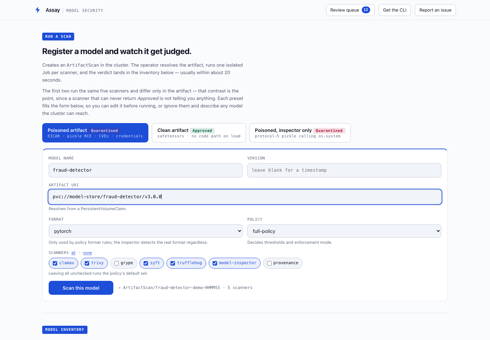

# Assay

[](https://github.com/DAVANO-INNOVATION-LAB/assay/actions/workflows/ci.yml)
[](https://pkg.go.dev/github.com/DAVANO-INNOVATION-LAB/assay)
[](https://goreportcard.com/report/github.com/DAVANO-INNOVATION-LAB/assay)
[](LICENSE)

**A model with a backdoor in it looks exactly like a model without one.**

Assay is supply-chain security for AI models on Kubernetes and OpenShift. It
scans every model version a registry publishes — for pickle code execution,
embedded credentials, malware and CVEs — verifies who signed it, and refuses
to let an unapproved one reach a running workload.

```bash
# No cluster needed. Streams only the headers it needs, not the whole model.
docker run --rm ghcr.io/davano-innovation-lab/assay-operator:0.1.0 \
  /assay inspect hf://openai-community/gpt2
```

```
  [Low     ] ASSAY-PICKLE-003  Pickle-based weights execute code on load
             at pytorch_model.bin
             this is inherent to the format, not a defect in this model —
             prefer safetensors, which cannot execute anything

  coverage: 25 read in full, 1 header-only, 0 not read
  verdict:  Approved (risk score 0/100)
```

Note what that says. gpt2's pickle weights *can* execute code, and Assay
reports it — at Low, and still approves the model, because that is true of
every pickle ever shipped and is not a defect in this one. A scanner that
raises an alarm on the ordinary case is a scanner people switch off. It also
reports that one file was read header-only, because *what was not examined* is
part of a verdict.



Its limits are documented rather than implied. A model poisoned in its
*weights* is byte-identical to a clean one, and no static scanner can see it —
so Assay says so, in [SECURITY.md](SECURITY.md) and in the
[MITRE ATLAS coverage map](internal/compliance/atlas.go), instead of letting
silence imply coverage.

## Why the Model Registry is the integration point

Watching ImageStreams only catches models that happen to be packaged as
container images. The Model Registry is where a model is *declared*, which
means Assay sees a model the moment it is registered, before anything tries to
deploy it, and regardless of whether the bytes live in S3, ODF, a PVC, an OCI
registry, or a ModelCar image.

## Pipeline

```
Model Registry ──▶ ModelRegistryConnector ──▶ ArtifactScan
                                                   │
                       ┌───────────────────────────┤ one Job per scanner
                       ▼                           ▼
                 fetch (init)               scan (init)
              resolve URI, stage         malware / CVE / SBOM
              bytes into /workspace      secrets / model format
                       │                           │
                       └──────────┬────────────────┘
                                  ▼
                            publish (main)
                        ArtifactScanReport CR
                                  │
                                  ▼
                     policy evaluation ──▶ ModelSecurityReport
                                                   │
                     verdict written back to registry
                                                   │
                                                   ▼
                                        admission webhook gates deploy
```

## What is here

| Component | Package | State |
|---|---|---|
| Model Registry client | `internal/registry` | Working: list, paginate, patch properties |
| Model sources | `internal/modelsource` | `Source` interface (List/Resolve/WriteBack); OpenShift registry + MLflow, MLflow live-tested |
| Standalone CLI | `cmd/assay` | Working: `assay inspect`, CI exit codes, JSON output |
| Metrics | `internal/metrics` | Admission decisions, scan verdicts and durations, scanner and sync failures |
| Packaging | `deploy/helm`, `config/` | Helm chart (3 webhook cert modes), Kustomize base + dev/enforcing overlays |
| Artifact resolvers | `internal/resolver` | HTTP and S3/ODF run end-to-end (S3 live-tested against MinIO); PVC mounted and covered; OCI/ModelCar compile but **untested against a real registry** |
| Scan orchestrator | `internal/controller` | Working: one Job per scanner |
| Model inspector | `internal/inspector` | Working: pickle, archive, format analysis |
| Result parsers | `internal/results` | Validated against real scanner output |
| Policy engine | `internal/policy` | Working: rules, exceptions, risk scoring |
| Admission gate | `internal/webhook` | Working: KServe natively; Deployments, StatefulSets, DaemonSets, Jobs, CronJobs and Pods are inspected for serving intent even when unannotated |
| Scanner images | `scanners/` | Built: ClamAV, Trivy, Syft, TruffleHog, Grype |
| AI RMF assessment | `internal/compliance` | Working: 72 controls, evidence-or-attestation |
| Cosign verification | `cmd/runner` | **Stub, and enabled by default** — emits one Medium "no verified signature" finding on every scan, so a clean model scores 10 rather than 0. Disable the `provenance` scanner in your policy if that floor is confusing |
| Behavioural AI evaluation | — | **Out of scope by design** — see the note under Roadmap |
| Console plugin | — | Phase 2 |

The operator builds, the test suite passes, the scanner images build and run,
and every scanner has been verified against a planted artifact with networking
disabled. CI runs build, vet, lint, the race-enabled unit suite, a CLI
end-to-end check, and the live MLflow scan on every push. What has not happened
yet is a run against a live OpenShift cluster with a real Model Registry.

> **Images.** Published to GitHub Container Registry under
> `ghcr.io/davano-innovation-lab`: the operator (`assay-operator:0.1.0`) and the
> five scanner images (`scanner-clamav`, `scanner-trivy`, `scanner-grype`,
> `scanner-syft`, `scanner-trufflehog`). Vulnerability databases are baked in,
> because scan Jobs run with networking disabled and a scanner that phones home
> fails on an air-gapped cluster.
>
> Built for **linux/amd64 and linux/arm64**. A Docker Hub mirror at
> `docker.io/davanolab` is planned; the manifests point at ghcr because that is
> what exists.
>
> If a pull returns `401 Unauthorized`, the package is still private — GitHub
> publishes container packages private by default regardless of the
> repository's visibility, and there is no API to change it. An owner has to
> flip each package to public under
> [the organisation's packages](https://github.com/orgs/DAVANO-INNOVATION-LAB/packages).

The one image carries all four binaries — the operator, the in-pod scan runner,
the console API server and the standalone CLI — so an air-gapped cluster mirrors
a single artifact, and the scanner is usable with no cluster at all:

```bash
make docker-build REGISTRY=<your-namespace>
docker run --rm --network none -v "$PWD/model:/m:ro" \
  --entrypoint /assay <your-namespace>/assay-operator:0.1.0 inspect /m
```

## The console

A single self-contained page showing every model's posture, the findings behind
each verdict, and how each scan was triggered — registry, runtime, periodic or
manual. See [docs/console.md](docs/console.md) for a walkthrough with
screenshots.


It is served by `assay-api`, which authenticates every request against your
identity provider and returns only what the signed-in subject may see. There is
no anonymous mode: the console shows exploitable detail — the file a malicious
pickle lives in, the credential that leaked — so it refuses to start without an
OIDC issuer and a role-bindings file.

```bash
assay-api \
  --oidc-issuer-url https://sso.example.com \
  --oidc-client-id assay --oidc-redirect-url https://assay.example/auth/callback \
  --bindings /config/bindings.yaml \
  --tls-cert-file /tls/tls.crt --tls-private-key-file /tls/tls.key
```

Five roles decide what a login can see, from `viewer` (a model exists and what
it was judged to be, nothing about why) to `admin`. `auditor` is the
interesting one: findings and compliance, but never the exploit path — enough
to audit, not enough to attack. See [config/samples/bindings.yaml](config/samples/bindings.yaml).

## Scanner images

Each scanner ships as its own image under `scanners/`. They all expose the
same two-argument contract — staged artifact directory, output file — so the
operator never encodes any one tool's CLI, and a scanner can be swapped
without touching the controller. `internal/scanners/catalog_test.go` enforces
that the catalog and the images stay in agreement, including that the file the
scanner writes is the file the publish step reads.

```bash
make scanners
```

```bash
make scanners-smoke
```

The smoke test runs every image against an artifact planted with an EICAR
file, vulnerable dependency pins, and live-looking credentials, under the same
constraints the operator applies in-cluster: no network, read-only root
filesystem, non-root user, all capabilities dropped.

### Air-gap

Nothing here *enforces* the absence of egress — there is no NetworkPolicy on
scan pods, and `Definition.NeedsNetwork` is declared but unread. What follows
is a property of how the images are built, not a control:

Vulnerability and malware databases are baked in at build time, so a scan
needs no egress at all — refreshing signatures means rebuilding the image.
That is the right tradeoff for a disconnected cluster: the alternative is a
scanner that silently reports clean because it could not reach its mirrors.
The ClamAV entrypoint refuses to run against an empty signature database for
the same reason.

To mirror into a disconnected registry:

```bash
make mirror-list
```

Then point the operator at the mirror with `--scanner-registry`. Image
references are resolved at Job build time, so nothing in the catalog is
pinned to a host the cluster cannot reach.

Image tags are pinned rather than `:latest` — a recorded verdict has to keep
meaning the same thing on a later scan.

### Parser fixtures

`internal/results/testdata/real_*` holds verbatim output captured from these
images. The hand-written tests check the formats the parsers expect; the
fixture tests check the formats the tools actually emit, which is the only
thing that catches an assumption that was wrong from the start. Refresh them
after bumping a scanner version:

```bash
make scanner-fixtures
```

## The model inspector

This is the part a generic container scanner cannot do. Trivy sees a model as
an opaque blob; the inspector understands the serialization formats:

- **Pickle analysis** — flags `GLOBAL`/`REDUCE` opcodes and dangerous imports
  (`os.system`, `subprocess.Popen`, `builtins.eval`) in `.pkl`, `.joblib`, and
  in pickles nested inside `torch.save` zip archives.
- **Archive safety** — zip slip, symlink escapes, entry-count limits, and
  compression-ratio checks for zip bombs.
- **Hugging Face configs** — `trust_remote_code: true` and `auto_map`, both of
  which hand execution to model-supplied Python at load time.
- **Format validation** — safetensors header bounds, numpy object-dtype arrays
  (which are pickles in disguise), suspicious ONNX operators.
- **Hidden payloads** — ELF/PE/Mach-O binaries and shell scripts behind
  innocuous file extensions.

Detection is evidence-based rather than heuristic. A numeric `.npy` array or a
raw `.bin` tensor dump contains every pickle opcode byte by coincidence;
`internal/inspector/falsepositive_test.go` pins the inert cases that must stay
silent, because a scanner that cries wolf gets switched off.

## Standalone CLI

The inspector and the policy engine both run without a cluster, so the same
analysis ships as a single static binary. This is the fastest way to try Assay
and the natural fit for a CI gate or a pre-commit hook.

```
make cli                       # builds bin/assay
bin/assay inspect ./model      # scan a file or directory
bin/assay inspect --json ./m   # machine-readable report for CI
```

The verdict comes from the same `internal/policy` engine the operator runs
with its default policy, so a local `Quarantined` is a cluster `Quarantined`.
Exit codes are made for gating:

| Code | Verdict | Meaning |
|---|---|---|
| 0 | Approved | no policy violations |
| 2 | ReviewRequired | non-critical violations |
| 3 | Quarantined | a critical finding — the artifact executes code on load |
| 1 | — | the scan itself failed (bad path, I/O error) |

A finding never exits 1: a completed scan reports its verdict through the
verdict codes, so a CI step can branch on "clean vs. blocked vs. broken".

```
$ assay inspect ./sketchy-model
assay v0.2.0 — ./sketchy-model
scanned 1 file(s), formats: [pickle]

  [Critical] ASSAY-PICKLE-001  Pickle imports a dangerous callable
             at weights.pkl
             pickle stream references posix.system, which executes on load

findings: 1 critical, 0 high, 0 medium, 0 low
policy violation: blockUnsafeModel: 1 critical model-inspection finding(s): the artifact executes code on load

verdict: Quarantined (risk score 60/100)
```

Release binaries for macOS and Linux (amd64/arm64) come from `make cli-release
VERSION=vX.Y.Z`, which writes them to `dist/`.

## Model sources

A *source* is a system that declares model versions and can carry a verdict —
distinct from a storage *resolver*, which only knows where the bytes live. The
`internal/modelsource` package is one interface over both:

```go
type Source interface {
    Name() string
    List(ctx) ([]Version, error)                       // discover versions
    Resolve(ctx, Version, destDir) (*Artifact, error)  // stage the bytes
    WriteBack(ctx, Version, Verdict) error              // record the verdict
}
```

Registry scanning and MLflow scanning become the same pipeline with a
different source — one spine, many triggers. Two sources implement it today:

- **OpenShift AI Model Registry** (`model-registry`) — the platform Assay was
  built around; write-back lands as namespaced custom properties.
- **MLflow** (`mlflow`) — lists every registered model version, stages
  artifacts through the tracking server's artifact proxy (or defers `s3://`
  and `oci://` sources to the storage resolvers), and writes the verdict back
  as `assay.verdict` / `assay.risk_score` tags visible in the MLflow UI.

The MLflow path is exercised end to end against a real tracking server in
Docker — register a malicious pickle, scan it, assert Quarantined and the
verdict tag written back:

```bash
make test-mlflow
```

## Security model of a scan

Scan pods handle bytes from an untrusted source, so the Job is split into
three steps with different privileges:

1. **fetch** (init container) — resolves the URI and stages bytes. Gets
   registry and storage credentials, no cluster API access.
2. **scan** (init container) — runs the scanner. No credentials at all, no
   cluster API access, read-only root filesystem, all capabilities dropped.
   A bounded `emptyDir` at `/tmp` is the only writable path, which is what
   lets the read-only root filesystem hold for tools that need scratch space.
3. **publish** (main container) — parses results and writes one
   `ArtifactScanReport`. Its ServiceAccount can create that one resource type
   and nothing else.

Because scan and publish are ordered init-then-main, publish only runs after
the scanner exits, and it is the single component in the pod holding a token.

## NIST AI RMF 1.0 reporting

Assay assesses every scanned model version against the AI RMF Core and records
the result as a `ComplianceReport`. The mapping is deliberately conservative.

The AI RMF is a **voluntary organizational risk-management framework, not a
technical control baseline**. Of its 72 subcategories, most describe things no
scanner can observe — that staff are trained, that a diverse team reviewed a
decision, that leadership accepted a risk. The honest split:

| | Controls |
|---|---|
| Assay evidences in full | 9 |
| Assay evidences in part | 24 |
| Attestation-only | 39 |

Two rules keep the report auditable:

- **A control Assay cannot observe never comes back `Satisfied` from a scan.**
  It requires a `ControlAttestation` naming a person, with an expiry, or it
  stays open. An expired attestation reopens its control; an unattributed one
  is rejected outright.
- **Nothing is inferred across trustworthiness characteristics.** A clean
  security scan says nothing about fairness, so `MEASURE 2.11` stays open
  until bias evaluation ships in Phase 2. Every assessment publishes the
  characteristics it did *not* measure, which is what `MEASURE 1.1` asks for.

A perfect scan therefore cannot report framework conformance, and
`TestPerfectScanIsNotFrameworkConformance` fails the build if it ever does.

```bash
kubectl apply -f config/samples/compliance.yaml
```

```bash
kubectl get compliancereports -n assay-system
```

## Custom resources

| Kind | Purpose |
|---|---|
| `ModelRegistryConnector` | Connection to a Model Registry; polls and syncs |
| `ArtifactScan` | One scan of one artifact; owns the scan Jobs |
| `ArtifactScanReport` | Detailed findings from one scanner |
| `ModelSecurityReport` | Consolidated posture per model version; the gate reads this |
| `ArtifactScanPolicy` | Scanner set, pass/fail rules, enforcement mode |
| `ArtifactException` | Time-boxed waiver for specific rules |
| `TrustedPublisher` | Signing identity whose artifacts are trusted |
| `PromotionRequest` | **Declared, not implemented** — no controller reads it, and `ApprovedEnvironments` is read by the admission gate but written by nothing, so environment gating never fires |
| `ComplianceProfile` | Governance framework plus its human attestations |
| `ComplianceReport` | A model version assessed against that framework |

Detailed findings stay in the cluster; only a summary is written back to the
registry.

## Installing

Build and publish the operator and scanner images first:

```bash
make docker-build docker-push scanners scanners-push
```

Then pick an install path. All three deploy the same thing.

**Helm** — the packaged path, and the only one that can issue webhook
certificates on a cluster without OpenShift's service CA operator:

```bash
helm install assay deploy/helm/assay --namespace assay-system --create-namespace
```

The one setting to get right is `webhook.certMode`. It defaults to `openshift`,
which relies on the service CA operator to issue and rotate the serving cert.
On any other cluster that Secret is never created and the pod sits in
`ContainerCreating`, so use cert-manager there:

```bash
helm install assay deploy/helm/assay --namespace assay-system --create-namespace \
  --set webhook.certMode=cert-manager
```

There is deliberately no self-signed fallback: a webhook whose certificate the
API server cannot verify is skipped silently under `failurePolicy: Ignore`,
which is indistinguishable from a gate that is working.

Scans run in the namespace of the `ArtifactScan`, and the scan ServiceAccount
must exist there or the pod is never admitted and the scan hangs in `Pending`:

```bash
helm install assay deploy/helm/assay --namespace assay-system --create-namespace \
  --set scanner.additionalNamespaces='{team-a,team-b}'
```

**Kustomize** — the kubebuilder-native path:

```bash
kubectl apply -k config/default          # OpenShift; webhook on
kubectl apply -k config/overlays/dev     # kind/dev; single replica, webhook off
kubectl apply -k config/overlays/enforcing  # --require-report=true + failurePolicy: Fail
```

**Make** — plain YAML, no tooling:

```bash
make install deploy
```

Then point Assay at a registry and give it a policy:

```bash
kubectl apply -f config/samples/policy.yaml
kubectl apply -f config/samples/connector.yaml
```

Opt a namespace into deployment gating:

```bash
kubectl label namespace my-models security.davano.io/enforce=true
```

Watch what happens:

```bash
kubectl get artifactscans -n assay-system -w
```

## Enforcement defaults

Two defaults are deliberately permissive so that installing Assay cannot break
a running cluster, and both should be tightened once coverage is complete:

- `--require-report=false` admits models that have never been scanned. Set it
  to `true` once every model in the registry has a report.
- The webhook's `failurePolicy: Ignore` keeps a Assay outage from blocking all
  model deployments. `Fail` is the stronger setting, because `Ignore` means
  anyone who can disrupt Assay can also bypass the gate.

Because both defaults fail open, a gate that is doing nothing looks exactly
like a gate that is working. That is what the metrics below are for.

## Watching the gate

`assay_admission_decisions_total{outcome="allowed_unscanned"}` is the number
that matters: workloads admitted **only** because Assay had no report for
them. It is not a measure of safety — it is a measure of how much the gate is
not covering. `outcome="allowed_skip_annotation"` counts workloads that opted
out with `security.davano.io/skip-validation`, which any author can set on
their own workload.

Alongside those: `assay_scan_verdicts_total`, `assay_scan_duration_seconds`,
`assay_scanner_results_total` (a scanner erroring on everything produces no
findings, which scores identically to a clean result), and
`assay_source_sync_failures_total`.

```bash
kubectl apply -f config/monitoring/metrics.yaml
```

That ships a Service, a ServiceMonitor, and alerts for each of the failure
modes above. The ServiceMonitor and PrometheusRule need the Prometheus
Operator; the Service alone is enough to scrape or port-forward by hand.

### The gate needs to know where reports live

Scans run in the operator's namespace; the workloads being gated run in the
teams' namespaces. The gate therefore searches the workload's namespace first
and then `--report-namespace` (defaulted from `POD_NAMESPACE`). If neither
holds the report, the model is treated as unscanned — so if that flag is unset
and reports live elsewhere, the gate finds nothing and admits everything. The
manager logs a warning at startup when it cannot determine the namespace.

## Development

```bash
make test
```

Requires Go 1.25+. `make manifests` regenerates CRDs and RBAC from the
kubebuilder markers; `make generate` regenerates DeepCopy methods.
`make test-mlflow` runs the live MLflow integration test (needs Docker).

See [CONTRIBUTING.md](CONTRIBUTING.md) for what a good change looks like here —
in particular the fail-closed rule, which is the one that matters most.

## Compliance

NDAA FY2026 §1513 folds an AI security framework into DFARS as a CMMC
extension, which turns model provenance and AI bills of materials into
contractual requirements for the Defense Industrial Base. Assay maps to
**NIST SP 800-53 Rev 5**, **NIST AI RMF 1.0** and **MITRE ATLAS**, and emits an
evidence bundle an authorizing official can verify offline.

It produces evidence, not compliance — a distinction [docs/compliance.md](docs/compliance.md)
takes seriously, including the controls it cannot speak to.

## Security

To report a vulnerability, see [SECURITY.md](SECURITY.md). Anything that makes
Assay report an unsafe artifact as safe, or gets a model past the admission
gate, goes to DAVANO@davano.net rather than a public issue.

The limits are documented rather than implied. Weight-level model poisoning,
training-data poisoning, runtime evasion and registry rug pulls are out of scope
**by construction** — a scanner that inspects an artifact cannot observe them.
The MITRE ATLAS mapping in `internal/compliance/atlas.go` lists them explicitly,
with reasons, alongside what Assay does detect.

## Roadmap

**Phase 1 (current)** — registry connector, scan orchestration, malware and
CVE scanning, SBOM, admission gate.

**Phase 2** — Sigstore verification against `TrustedPublisher` has landed
(bundles, model-transparency manifests, and detached keys, with partial
signature coverage reported as its own finding). Remaining: promotion
workflows and an OpenShift console plugin.

> **On "AI safety" evaluation.** Prompt-injection resistance, backdoor
> detection, and adversarial robustness are open research problems, not
> shippable scanner checks. Assay deliberately does **not** claim them. The
> product line is supply-chain security for the model *artifact* — malware,
> unsafe deserialization, CVEs, secrets, provenance — where the checks are
> concrete and verifiable. Anything model-*behaviour* is out of scope by
> design, not on a roadmap.

**Phase 3** — multi-cluster federation, Hugging Face / Kubeflow connectors,
continuous compliance and runtime monitoring. MLflow support has landed early
via the `modelsource.Source` interface (see **Model sources**); the next
source to wire into the in-cluster controller is the natural follow-on.
